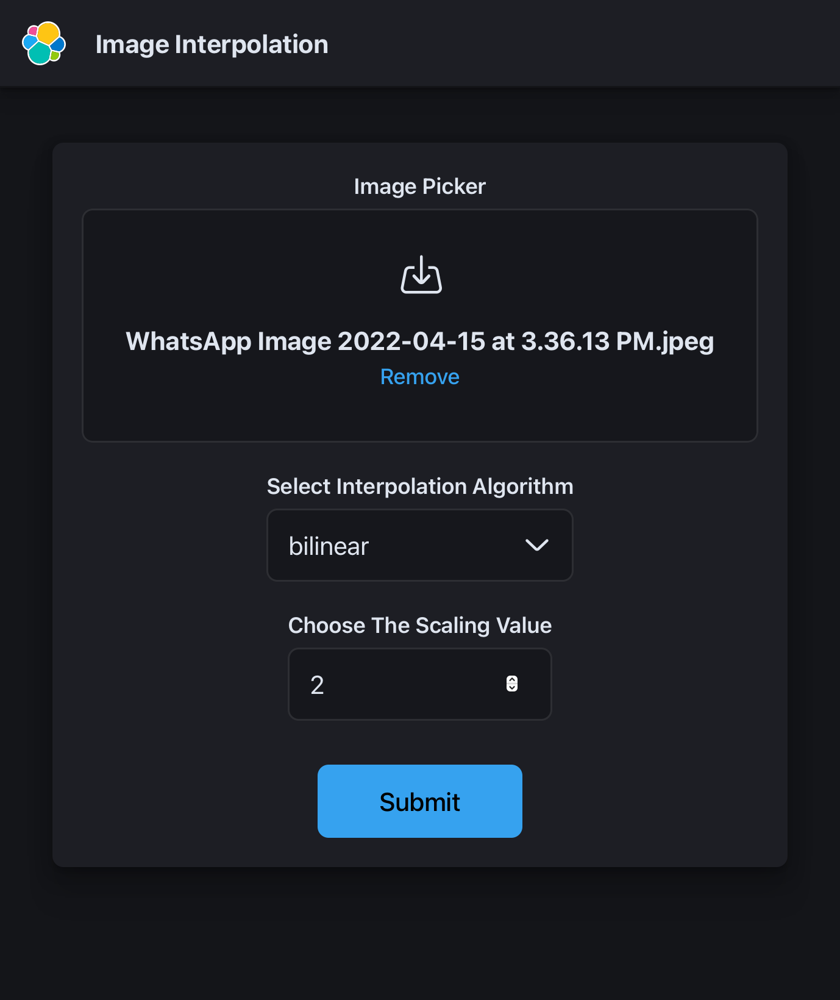
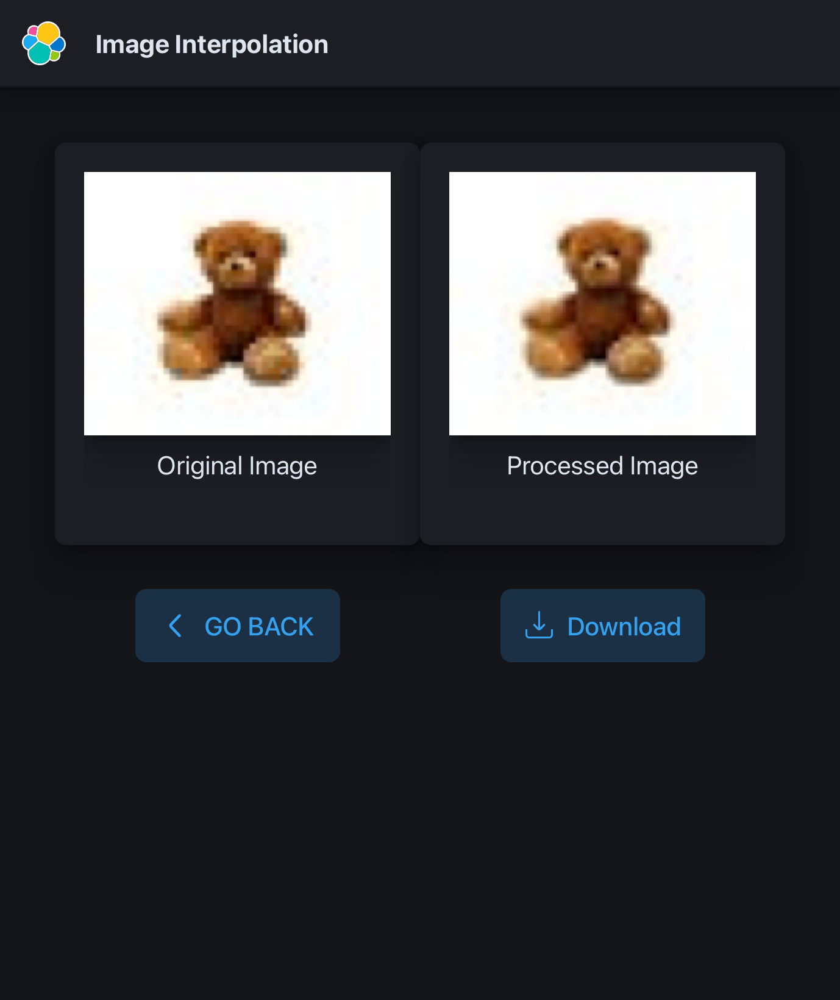

 <a href="" >
   
 </a>

# Image Interpolation Project

## Team : PLASMA
## Participants
### Harsh Mukesh Shah
Roll No. - BTECH/10561/19
Email Id - btech10561.19@bitmesra.ac.in
Mobile No. - 9979197187
### Vidhan Goyal
Roll No. - BTECH/10578/19
Email Id - btech10578.19@bitmesra.ac.in
Mobile No. - 7987321671
### Shanu Kumar Singh
Roll No. - BTECH/10440/19
Email Id - btech10440.19@bitmesra.ac.in
Mobile No. - 7004803494
### Shreesh Lahauriya
Roll No. - BTECH/10576/19
Email Id - btech10576.19@bitmesra.ac.in
Mobile No. - 9305963316
### Manjeet Singh
Roll No. - BTECH/10008/19
Email Id - btech10008.19@bitmesra.ac.in
Mobile No. - 6006173301
### Ishan Kumar
Roll No. - BTECH/10612/19
Email Id - btech10612.19@bitmesra.ac.in
Mobile No. - 9582021206

## Overview
This project implements different interpolation algorithms such as nearest neighbor, bilinear bicubic and idw. 

Presented as a web application this project is interactive.

## Tech Stack
	HTML  |  CSS  |  JS  |  PYTHON  |  REACT JS  |  JAVA  | SPRING (Framework) 


## Frontend Installation

### Requirements
For building and running the application you need:

- [Nodejs](https://nodejs.org/en/download/)
- [Browser](https://www.google.com/intl/en_in/chrome/)


## Running the application locally
1. Clone this repository on local machine.
2. Open the project in an IDE.
3. Install all the requirements.
```shell
npm install -f
```
4. Deploy locally
```shell
npm start
```
5. Open a web browser and go to [http://localhost:3000/](http://localhost:3000/)

## App Screenshots
### Welcome Screen


### Output Screen


## Cloud Deployment
This app has been deployed on the cloud for easy accessibility

Go to [image-interpolation](https://image-interpolation.herokuapp.com/) using any web browser.
